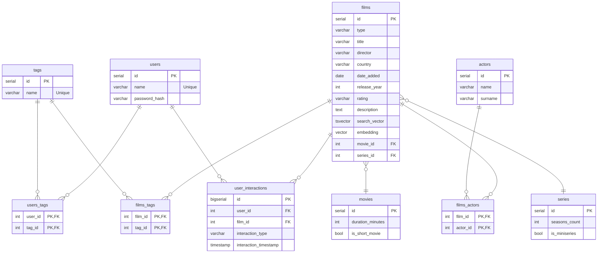

# Database Schema

## ERD (Mermaid)

## Details
- **embeddings**: `vector(384)` for semantic search (all-MiniLM-L6-v2).
- **search_vector**: `tsvector` column for PostgreSQL Full-Text Search fallback.
- **constraints**: `films` table uses a `one_type_only` check to ensure strict typing between movies and series.
